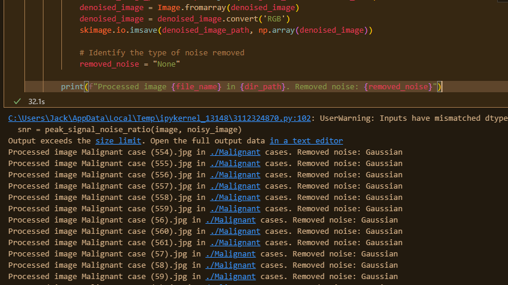

<h1>IMAGE DENOISING USING MACHINE LEARNING</h1>
This is a hybrid image denoising approach combining CNNs, wavelet transform and linear filters will result in improved performance in terms of denoising performance, producing visually realistic denoised images while maintaining good preservation of image details and texture compared to individual methods alone. below are extra instructions.

<h2>Files</h2>
<ol>
<li> `Experiment_one_CNN.ipynb` this is the convolutional neural network that the images will be passed through after being denoised by discrete wavelength tranforms</li>
<li> `Experiment_two_identifying_noisy_images.ipynb`  - this is the ipynb file that reads the three directories 
    <ul>
    <li>Bengin cases</li>
    <li>Malignant cases</li>
    <li>Normal case</li>
    </ul>
and identifies the nosiy images in each. It then proceeds to store the noisy images in new folders with the respective names

This file uses a combination of `mean_squared_error()` and `peak_signal_noise_ratio()` functions to increase the efficiency of identifying the noisy images

</li>
<li> `Experiment_two_type_of_noise_removed.ipynb` - this is the discrete wavelet transform file that denoises the noisy images and shows the type of noise removed

 
 <!--  -->
   
  

</li>

</ol>

<h2>Requirements</h2>
This codebase requires the following libraries:

<ul>
<li>Tensorflow</li>
<li>Keras</li>
<li>Numpy</li>
<li>OpenCV</li>
</ul>

<h2>Usage</h2>
To run the image super-resolution code, follow these steps:

<ol>
<li>Clone this repository to your local machine.</li>
<li>Install the required libraries using `pip install tensorflow keras numpy opencv-python`.</li>
<li>Open the `*.ipynb`(any ipynb of your choice) file in a Python IDE.</li>
<li>Modify the `input_image_path` variable to point to the noisy input image you need for the experiment.</li>
<li>Modify the `output_image_path` variable to specify the output location for the denoising image.</li>
<li>The denoised image will be saved to the specified output path.</li>
</ol>

<!-- <h2>Evaluation</h2>
We can evaluate the performance of the image super-resolution using the following metrics:

<ul>
<li>Peak Signal-to-Noise Ratio (PSNR)</li>
<li>Structural Similarity Index (SSIM)</li>
<li>Mean Squared Error (MSE)</li>
</ul> -->

To calculate these metrics, follow these steps:
<ol>
<li>Modify the evaluate function to set the input and output paths for the images, </li>
<li>Run the evaluate function.</li>
<li>The PSNR, SSIM, and MSE scores will be printed to the console.</li>
</ol>

